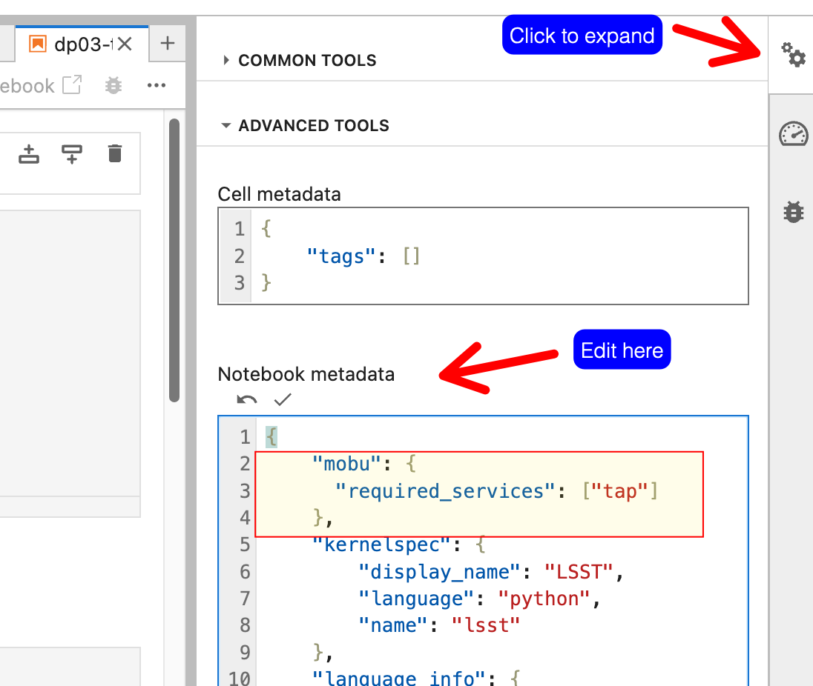

#################################
Configuring notebooks run by mobu
#################################

Some mobu behavior can be controlled by files within notebook repos that mobu clones and runs.

Specify which notebooks to run
==============================

.. warning::

   This feature will not work correctly with notebooks that have ``*``, ``?``, ``[``, or ``]`` in their names.
   The patterns are assumed to use the `Python pathlib glob pattern language`_.
   These characters have special meaning and they will not be explicitly matched.

You tell mobu to only run certain notebooks by creating a ``mobu.yaml`` file at the root of your notebook repo with ``collection_rules``:

.. code-block:: yaml

   collection_rules:
     - type: "exclude_union_of"
       patterns:
         - "not-these/**"
         - "not/these/either/**"
     - type: "intersect_union_of"
       patterns:
         - "this.ipynb"
         - "these/**"
         - "also/these**"
     - type: "intersect_union_of"
       patterns:
         - "**/these-*"

Each entry is a pattern using the `Python pathlib glob pattern language`_.

- Start with all notebooks in the repo.

- For each collection rule, remove notebooks:

  - Intersect rules will remove notebooks that are not in the
    intersection of:

      - The current set

      - The union of the matched patterns.

  - Exclude rules will remove notebooks from the current set that are
    in the union of the matched patterns.

- Remove any remaining notebooks that require unavailable applications.

.. note::

   Each collection rule will only remove notebooks. A rule can never add notebooks back after another rule has already removed them.

 .. _Python pathlib glob pattern language: https://docs.python.org/3/library/pathlib.html#pathlib-pattern-language

Examples
--------
With this repo structure:

.. code-block::

  ├── dont
  │   └── run
  │       └── these
  │           ├── nope_some_notebook.ipynb
  │           ├── some_notebook.ipynb
  │           └── some_other_notebook.ipynb
  ├── nope_some_notebook.ipynb
  ├── nor
  │   └── these
  │       └── some_notebook.ipynb
  ├── some
  │   └── directory
  │       └── some_notebook.ipynb
  ├── someother
  │   └── directory
  │       └── some_notebook.ipynb
  └── some_notebook.ipynb

Run specific notebooks:

.. code-block:: yaml

   collection_rules:
     - type: intersect_union_of
       patterns:
       - "some/directory/some_notebook.ipynb"
       - "some_notebook.ipynb"

.. code-block::

  ./some_notebook.ipynb
  ./some/directory/some_notebook.ipynb

Run every notebook except a single notebook:

.. code-block:: yaml

   collection_rules:
     - type: exclude_union_of
       patterns:
         - "some/directory/some_notebook.ipynb"

.. code-block::

  ./dont/run/these/some_notebook.ipynb
  ./dont/run/these/some_other_notebook.ipynb
  ./dont/run/these/nope_some_notebook.ipynb
  ./nor/these/some_notebook.ipynb
  ./someother/directory/some_notebook.ipynb
  ./some_notebook.ipynb
  ./nope_some_notebook.ipynb

Don't run notebooks in certain directories:

.. code-block:: yaml

   collection_rules:
     - type: exclude_union_of
       patterns:
         - "dont/run/these/**"
         - "nor/these/**"

.. code-block::

  ./some/directory/some_notebook.ipynb
  ./some_notebook.ipynb
  ./nope_some_notebook.ipynb

Don't run any notebooks with a ``nope_`` prefix:

.. code-block:: yaml

   collection_rules:
     - type: exclude_union_of
       patterns:
         - "**/nope_*.ipynb"

.. code-block::

  ./some/directory/some_notebook.ipynb
  ./someother/directory/some_notebook.ipynb
  ./dont/run/these/some_notebook.ipynb
  ./dont/run/these/some_other_notebook.ipynb
  ./nor/these/some_notebook.ipynb
  ./some_notebook.ipynb

Run only notebooks with a certain name, but not if they exists in certain directories:

.. code-block:: yaml

   collection_rules:
     - type: intersect_union_of
       patterns:
         - "**/some_notebook.ipynb"
     - type: exclude
       patterns:
         - "dont/run/these/**"
         - "nor/these/**"

.. code-block::

  ./some/directory/some_notebook.ipynb
  ./someother/directory/some_notebook.ipynb
  ./dont/run/these/some_notebook.ipynb
  ./some_notebook.ipynb

 Run notebooks that match a prefix but only in certain directories:

 .. code-block:: yaml

    collection_rules:
      - type: intersect_union_of
        patterns:
          - "some_directory/**"
          - "someother/directory**"
      - type: intersect_union_of
        patterns:
          - "**/some_*.ipynb"

 .. code-block::

   ./some/directory/some_notebook.ipynb
   ./someother/directory/some_notebook.ipynb

Service-specific notebooks
==========================

Each mobu instance knows what other `applications <https://phalanx.lsst.io/applications/index.html>`_ are running in its environment.
You can annotate a notebook to specify that it should only be run if certain applications are available.
Add a ``mobu`` section to the notebook metadata with a ``required_applications`` key:

.. code-block:: jsonnet

   {
     "metadata": {
       "mobu": {
         "required_applications": ["tap"]
       },
   }

Notebook metadata can be edited directly with an editor ("Edit Cell Tags (JSON)" in VS Code and look for the "metadata" key) or from the JupyerLab Property Inspector:

For instance:

Annotating notebooks in this way is optional and depending on flock configuration redundant; for example, at Rubin mobu is configured to run the Rubin Science Platform tutorial notebooks only on Rubin Science Platform clusters, so all required applications can be assumed to be available.
This feature is more useful for notebook payload repos that perform monitoring actions.
In such a case, annotating notebooks not to check a service that is not expected to be available on a particular environment prevents false positive noise.
