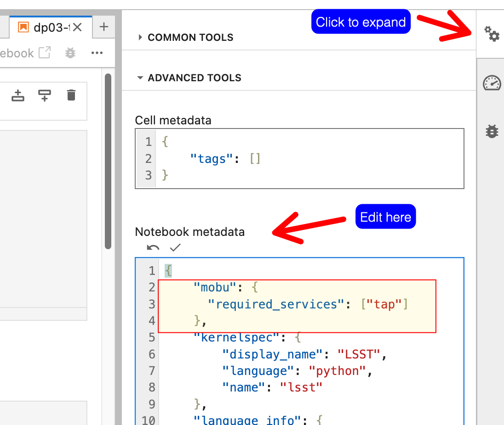

#################################
Configuring notebooks run by mobu
#################################

Some mobu behavior can be controlled by files within notebook repos that mobu clones and runs.

Specify which notebooks to run
==============================

You tell mobu to only run certain notebooks by creating a ``mobu.yaml`` file at the root of your notebook repo with a ``exclude_patterns`` and ``include_patterns`` keys:

.. code-block:: yaml

   exclude_patterns:
     - "some-dir/**"
     - "some-other-dir/**"
   include_patterns:
     - "some-notebook.ipynb"
     - "**/prefix-*.ipynb"

Each entry is a pattern using the `Python pathlib glob pattern language`_.

For ``exclude_patterns``: **None** of the notebooks that match the pattern will be run.

For ``include_patterns``: **Only** notebooks that match the pattern will be run.

Every for either of these keys only reduces the set of notebooks that will be run.
An entry in ``include_patterns`` will never add back a notebook that has been removed from another ``include_patterns`` or ``exclude_patterns`` value.

Examples
--------
With this repo structure:

.. code-block::

  ├── dont
  │   └── run
  │       └── these
  │           ├── nope_some_notebook.ipynb
  │           ├── some_notebook.ipynb
  │           └── some_other_notebook.ipynb
  ├── nope_some_notebook.ipynb
  ├── nor
  │   └── these
  │       └── some_notebook.ipynb
  ├── some
  │   └── directory
  │       └── some_notebook.ipynb
  └── some_notebook.ipynb

Only run a single notebook:

.. code-block:: yaml

   include_patterns:
     - "some/directory/some_notebook.ipynb"

.. code-block::

  ./some/directory/some_notebook.ipynb

Run every notebook except a single notebook:

.. code-block:: yaml

   exclude_patterns:
     - "some/directory/some_notebook.ipynb"

.. code-block::

  ./dont/run/these/some_notebook.ipynb
  ./dont/run/these/some_other_notebook.ipynb
  ./dont/run/these/nope_some_notebook.ipynb
  ./nor/these/some_notebook.ipynb
  ./some_notebook.ipynb
  ./nope_some_notebook.ipynb

Don't run notebooks in certain directories:

.. code-block:: yaml

   exclude_patterns:
     - "dont/run/these/**"
     - "nor/these/**"

.. code-block::

  ./some/directory/some_notebook.ipynb
  ./some_notebook.ipynb
  ./nope_some_notebook.ipynb

Don't run any notebooks with a ``nope_`` prefix:

.. code-block:: yaml

   exclude_patterns:
     - "**/nope_*.ipynb"

.. code-block::

  ./some/directory/some_notebook.ipynb
  ./dont/run/these/some_notebook.ipynb
  ./dont/run/these/some_other_notebook.ipynb
  ./nor/these/some_notebook.ipynb
  ./some_notebook.ipynb

Run only notebooks with a certain name, but not if they exists in certain directories:

.. code-block:: yaml

   include_patterns:
     - "**/some_notebook.ipynb"
   exclude_patterns:
     - "dont/run/these/**"
     - "nor/these/**"

.. code-block::

  ./some/directory/some_notebook.ipynb
  ./dont/run/these/some_notebook.ipynb
  ./some_notebook.ipynb

.. _Python pathlib glob pattern language: https://docs.python.org/3/library/pathlib.html#pathlib-pattern-language

Service-specific notebooks
==========================

Each mobu instance knows what other `services <https://phalanx.lsst.io/applications/index.html>`_ are running in its environment.
You can annotate a notebook to specify that it should only be run if certain services are available.
Add a ``mobu`` section to the notebook metadata with a ``required_services`` key:

.. code-block:: jsonnet

   {
     "metadata": {
       "mobu": {
         "required_services": ["tap"]
       },
   }

Notebook metadata can be edited directly with an editor ("Edit Cell Tags (JSON)" in VS Code and look for the "metadata" key) or from the JupyerLab Property Inspector:

For instance:

Annotating notebooks in this way is optional and depending on flock configuration redundant; for example, at Rubin mobu is configured to run the Rubin Science Platform tutorial notebooks only on Rubin Science Platform clusters, so all required services can be assumed to be available.
This feature is more useful for notebook payload repos that perform monitoring actions.
In such a case, annotating notebooks not to check a service that is not expected to be available on a particular environment prevents false positive noise.
