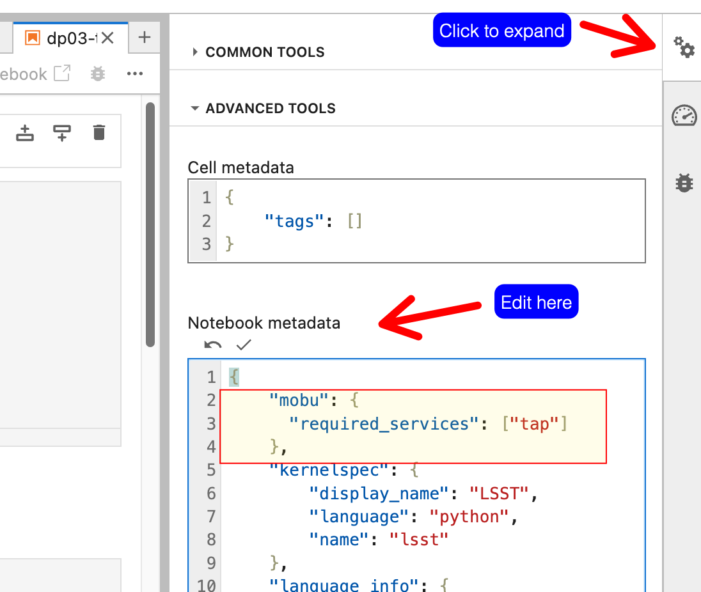

#################################
Configuring notebooks run by mobu
#################################

Some mobu behavior can be controlled by files within notebook repos that mobu clones and runs.

Exclude notebooks in specific directories
=========================================

You can tell mobu to exclude notebooks in specific directories by creating a ``mobu.yaml`` file at the root of your notebook repo that looks like this:

.. code-block:: yaml

   exclude_dirs:
     - "some-dir"
     - "some-other-dir"

This prevents mobu from executing any notebooks in these directories or any descendant directories.
These directories are relative to the repo root.

Service-specific notebooks
==========================

Each mobu instance knows what other `services <https://phalanx.lsst.io/applications/index.html>`_ are running in its environment.
You can annotate a notebook to specify that it should only be run if certain services are available.
Add a ``mobu`` section to the notebook metadata with a ``required_services`` key:

.. code-block:: jsonnet

   {
     "metadata": {
       "mobu": {
         "required_services": ["tap"]
       },
   }

Notebook metadata can be edited directly with an editor ("Edit Cell Tags (JSON)" in VS Code and look for the "metadata" key) or from the JupyerLab Property Inspector:

For instance:

Annotating notebooks in this way is optional and depending on flock configuration redundant; for example, at Rubin mobu is configured to run the Rubin Science Platform tutorial notebooks only on Rubin Science Platform clusters, so all required services can be assumed to be available.
This feature is more useful for notebook payload repos that perform monitoring actions.
In such a case, annotating notebooks not to check a service that is not expected to be available on a particular environment prevents false positive noise.
